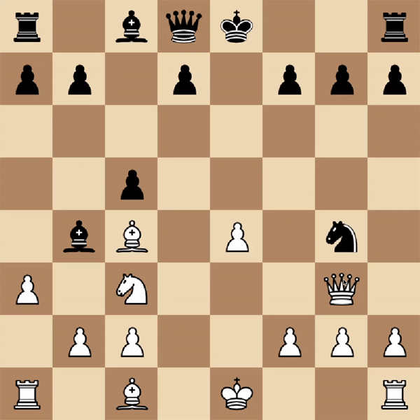

# MiniMax search for Chess player agent
Design of a chess game system with the implementation of minimax search to design an agent capable of determining best move accounting for all game states 5 movements ahead.

Video of game simulation: https://www.youtube.com/watch?v=jiJRSv6KRj8&t

